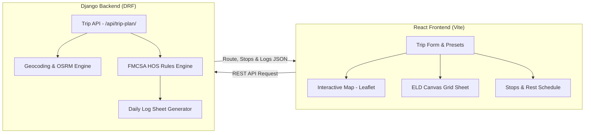

# 🚛 SpotterAI — Full-Stack ELD Trip Planner

A full-stack web application designed for commercial property-carrying drivers and fleet dispatchers to plan routes with automated **Hours of Service (HOS)** compliance, mandatory rest & fueling stop planning, and **FMCSA-compliant Electronic Logging Device (ELD) daily log sheets**.

---

## 🌟 Features

- **Route Optimization & Mapping**: Takes *Current Location*, *Pickup Location*, *Dropoff Location*, and *Current Cycle Hours Used* as inputs, then visualizes the entire driving route on an interactive Leaflet/OpenStreetMap interface.
- **FMCSA Hours of Service (HOS) Engine**:
  - **70 Hours / 8 Days Rule**: Tracks accumulated duty time across rolling 8-day cycle and calculates 34-hour restarts when needed.
  - **11-Hour Driving Limit**: Limits driving to a maximum of 11 hours following 10 consecutive hours off duty.
  - **14-Hour Duty Window**: Prohibits driving beyond the 14th consecutive hour after coming on duty.
  - **30-Minute Rest Break**: Automatically schedules mandatory 30-minute off-duty breaks within 8 cumulative hours of driving.
  - **10-Hour Off-Duty / Sleeper Berth**: Schedules full 10-hour rest periods at strategic stops along the route.
  - **1-Hour Pickup & 1-Hour Drop-Off**: Automatically schedules and logs on-duty loading/unloading time.
  - **Fueling Rules**: Enforces fueling stops at least once every 1,000 miles.
- **Dynamic ELD Daily Log Sheets**:
  - Pixel-perfect HTML5 Canvas implementation drawing the standard **FMCSA 24-hour grid**.
  - 4-Tier Duty Status Lines: *Off Duty*, *Sleeper Berth*, *Driving*, and *On Duty (Not Driving)* with smooth status transition lines.
  - Automatic multi-sheet generation for trips extending over multiple 24-hour periods.
  - Interactive day navigation + complete printable sheets.
- **Live Autocomplete**: Real-time address geocoding with quick presets for rapid testing.
- **Modern UI/UX**: Dark mode theme with glassmorphism, accent glow, and responsive design.

---

## 🏗️ Architecture & Tech Stack



- **Backend**: Django 6.0, Django REST Framework, Django CORS Headers, OSRM / OpenStreetMap Nominatim.
- **Frontend**: React 18 / 19, Vite, Leaflet, React-Leaflet, Axios, Vanilla CSS Design System.

---

## 🚀 Running Locally

### 1. Backend (Django)

```bash
# Navigate to backend directory
cd backend

# Install dependencies
pip install -r requirements.txt

# Run migrations
python manage.py migrate

# Start the Django development server
python manage.py runserver 8000
```
*Backend API will be live at `http://localhost:8000/api/`*

### 2. Frontend (React + Vite)

```bash
# Navigate to frontend directory
cd frontend

# Install npm dependencies
npm install

# Start Vite dev server
npm run dev
```
*Frontend will be running at `http://localhost:5173/`*

---

## 🌐 Live Deployment Guide

### Deploy Backend (e.g. Render / Railway)
1. Push this repository to GitHub.
2. Create a new **Web Service** on [Render.com](https://render.com) pointing to the `backend/` folder.
3. Build Command: `pip install -r requirements.txt && python manage.py migrate`
4. Start Command: `gunicorn config.wsgi:application --bind 0.0.0.0:$PORT`
5. Set environment variable: `ALLOWED_HOSTS=*`, `DJANGO_DEBUG=False`.

### Deploy Frontend (Vercel)
1. Import your GitHub repository to [Vercel](https://vercel.com).
2. Set Root Directory to `frontend`.
3. Set Environment Variable: `VITE_API_URL=https://<your-backend-url>.onrender.com/api`
4. Deploy!

---

## 📹 Loom 3-5 Minute Walkthrough Outline

When recording your assessment video on [Loom](https://www.loom.com/):

1. **Introduction (30s)**: Introduce yourself, mention SpotterAI assessment, and state the objective (full-stack ELD route & log planner).
2. **Trip Input & Map Demonstration (60s)**:
   - Select a demo preset (e.g., *Denver ➔ Kansas City ➔ New York*).
   - Show the interactive map with Start, Pickup (with 1 hr loading), Dropoff (with 1 hr unloading), Fuel stops (<1,000 miles), and 10-hr rest stops.
3. **FMCSA HOS Engine & Log Sheets (90s)**:
   - Switch to the **ELD Logs** tab.
   - Walk through the canvas-drawn 24-hour grid for Day 1, Day 2, and Day 3.
   - Explain how 11-hour driving, 14-hour window, 30-minute break, and 70-hour/8-day cycles are maintained.
4. **Codebase & Architecture Walkthrough (60s)**:
   - Show `hos_engine.py` in the Django backend and explain how status timelines and stop intervals are calculated.
   - Show `eldDrawing.js` in the frontend canvas renderer.
5. **Conclusion (30s)**: Summary of deliverables and thank you.
